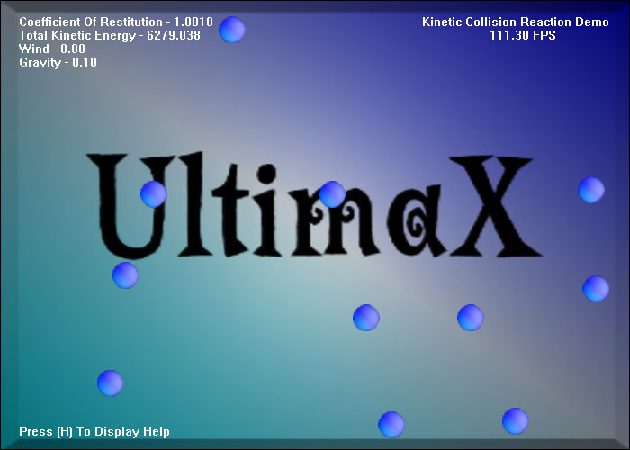



## AAA \- Kinetic Collision Responce Demo \(Physics\) With DX8

### Description

I'm trying to add physics to my game engine and I thought I would share it. It uses Mass, Gravity, Wind, kinetic energy, Friction, Coefficient Of Restitution, Velocity, and more. When the balls collide they transfer thier energy and react like they would in real life. Please vote for this one. I'm giving you part of my game engine to. Leave comments please. Any suggestions are welcome for they can only inprove my engine and knowledge.

This is Part 1. Part 2 is a Pool Ball Demo and Part 3 is a Spring Demo.

After I learn physics I'm going to learn AI. So keep your eye's out :)
 
### More Info
 

             |
---                |---
**Submitted On**   |2002-06-20 14:31:44
**By**             |[James Dougherty](https://github.com/Planet-Source-Code/PSCIndex/blob/master/ByAuthor/james-dougherty.md)
**Level**          |Advanced
**User Rating**    |5.0 (25 globes from 5 users)
**Compatibility**  |VB 6\.0
**Category**       |[Games](https://github.com/Planet-Source-Code/PSCIndex/blob/master/ByCategory/games__1-38.md)
**World**          |[Visual Basic](https://github.com/Planet-Source-Code/PSCIndex/blob/master/ByWorld/visual-basic.md)
**Archive File**   |[AAA\_\-\_Kine969826202002\.zip](https://github.com/Planet-Source-Code/james-dougherty-aaa-kinetic-collision-responce-demo-physics-with-dx8__1-36081/archive/master.zip)

